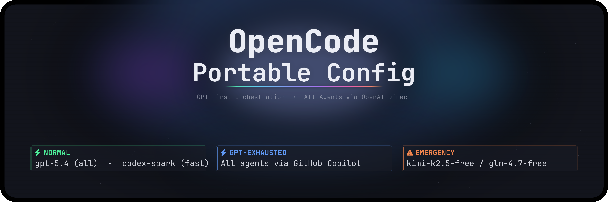

# OpenCode Portable Config (GPT-First)



Portable OpenCode/oh-my-opencode settings using a GPT-first strategy: all agents route to OpenAI GPT-5.4 directly. Fast tasks use GPT-5.3 Codex Spark. 3-tier fallback for full resilience.

## Files

- `opencode.json`
- `oh-my-opencode.json`
- `README.md`
- `README-Ko-KR.md`

## Apply On a New Machine

1. Back up existing files.
2. Copy these files into your OpenCode config directory.
3. Run doctor/check commands.

One-line prompt for your LLM agent:

```text
Please refer to [here](https://github.com/wjgoarxiv/opencode-gpt-portable-config). Clone or download this repo, then: (1) copy `opencode-configs/opencode.json` and `opencode-configs/oh-my-opencode.normal.json` into my OpenCode config path (`~/.config/opencode` on macOS/Linux, `%USERPROFILE%\.config\opencode` on Windows), renaming `oh-my-opencode.normal.json` to `oh-my-opencode.json`; (2) copy all fallback configs (`oh-my-opencode.gpt-exhausted.json`, `oh-my-opencode.fallback.json`) and `switch-config.sh` into the same directory; (3) make `switch-config.sh` executable; (4) back up any existing files first; (5) run doctor/check and confirm agents resolve correctly.
```

macOS/Linux default path:

```bash
mkdir -p ~/.config/opencode
cp opencode-configs/opencode.json ~/.config/opencode/opencode.json
cp opencode-configs/oh-my-opencode.normal.json ~/.config/opencode/oh-my-opencode.json
cp opencode-configs/oh-my-opencode.gpt-exhausted.json ~/.config/opencode/
cp opencode-configs/oh-my-opencode.fallback.json ~/.config/opencode/
cp opencode-configs/switch-config.sh ~/.config/opencode/
chmod +x ~/.config/opencode/switch-config.sh
```

Windows (PowerShell) default path:

```powershell
New-Item -ItemType Directory -Force "$env:USERPROFILE\.config\opencode" | Out-Null
Copy-Item .\opencode-configs\opencode.json "$env:USERPROFILE\.config\opencode\opencode.json" -Force
Copy-Item .\opencode-configs\oh-my-opencode.normal.json "$env:USERPROFILE\.config\opencode\oh-my-opencode.json" -Force
Copy-Item .\opencode-configs\oh-my-opencode.gpt-exhausted.json "$env:USERPROFILE\.config\opencode\" -Force
Copy-Item .\opencode-configs\oh-my-opencode.fallback.json "$env:USERPROFILE\.config\opencode\" -Force
Copy-Item .\opencode-configs\switch-config.sh "$env:USERPROFILE\.config\opencode\" -Force
```

## Model Routing

All agents route to OpenAI GPT-5.4 directly. Speed-critical tasks use GPT-5.3 Codex Spark or GPT-5.3 Codex.

### Normal Mode Agent Routing

| Agent | Model | Provider | Role |
|-------|-------|----------|------|
| **sisyphus** | gpt-5.4 (max) | OpenAI | Orchestrator |
| **hephaestus** | gpt-5.4 (medium) | OpenAI | Deep executor |
| **oracle** | gpt-5.4 (high) | OpenAI | Architecture / hard problems |
| **prometheus** | gpt-5.4 (max) | OpenAI | Strategic planning |
| **metis** | gpt-5.4 (max) | OpenAI | Plan verification |
| **plan** | gpt-5.4 | OpenAI | Step-by-step planning |
| **atlas** | gpt-5.4 | OpenAI | Task orchestration |
| **momus** | gpt-5.4 (medium) | OpenAI | Critic |
| **document-writer** | gpt-5.4 | OpenAI | Long-form documentation |
| **OpenCode-Builder** | gpt-5.4 | OpenAI | Project scaffolding |
| **frontend-ui-ux-engineer** | gpt-5.4 | OpenAI | Frontend / styling |
| **multimodal-looker** | gpt-5.4 | OpenAI | Multimodal workflows |
| **librarian** | gpt-5.3-codex | OpenAI | Fast doc research |
| **sisyphus-junior** | gpt-5.3-codex | OpenAI | Task execution worker |
| **explore** | gpt-5.3-codex-spark | OpenAI | File scanning / search |
| **build** | gpt-5.3-codex-spark | OpenAI | Build commands |

### Normal Mode Category Routing

| Category | Model | Provider |
|----------|-------|----------|
| visual-engineering | gpt-5.4 (high) | OpenAI |
| ultrabrain | gpt-5.4 (max) | OpenAI |
| deep | gpt-5.4 (medium) | OpenAI |
| artistry | gpt-5.4 (high) | OpenAI |
| quick | gpt-5.3-codex-spark | OpenAI |
| unspecified-low | gpt-5.3-codex | OpenAI |
| unspecified-high | gpt-5.4 (max) | OpenAI |
| writing | gpt-5.4 | OpenAI |

## Fallback System

3-tier fallback for full resilience. OpenCode does not support runtime auto-fallback — run the switch script manually, then restart OpenCode.

```
┌─────────────────────────────────────────────────────┐
│                    NORMAL (default)                  │
│         ./switch-config.sh normal                   │
│                                                     │
│  All thinking agents  → GPT-5.4 (OpenAI direct)    │
│  Research / workers   → GPT-5.3 Codex               │
│  Fast search / build  → GPT-5.3 Codex Spark         │
└─────────────────────┬───────────────────────────────┘
                      │
           OpenAI direct quota exhausted?
                      │ YES
                      ▼
┌─────────────────────────────────────────────────────┐
│                 GPT-EXHAUSTED                       │
│         ./switch-config.sh gpt-exhausted            │
│                                                     │
│  All agents → GitHub Copilot only                  │
│  Hephaestus → GPT-5.4 (Copilot)                   │
│  ultrabrain → GPT-5.4 (Copilot, max)              │
└─────────────────────┬───────────────────────────────┘
                      │
        Both OpenAI AND Copilot unavailable?
                      │ YES
                      ▼
┌─────────────────────────────────────────────────────┐
│                   EMERGENCY                         │
│         ./switch-config.sh emergency                │
│                                                     │
│  Heavy tasks → kimi-k2.5-free (256k ctx)           │
│  Fast tasks  → glm-4.7-free (128k ctx)             │
└─────────────────────────────────────────────────────┘

  Recovery: ./switch-config.sh normal → back to default
```

```
  Mode             Cost       Perf      Availability
  ────────────────────────────────────────────────────
  NORMAL           $$+        ★★★★★    OpenAI direct
  GPT-EXHAUSTED  $$         ★★★★½    Copilot only
  EMERGENCY        FREE       ★★★      Kimi/GLM (independent)
```

### When to Switch

| Symptom | Action | Command |
|---------|--------|---------|
| OpenAI direct 429/500/503 | Switch to gpt-exhausted | `./switch-config.sh gpt-exhausted` |
| All OpenAI calls failing (full outage) | Switch to gpt-exhausted | `./switch-config.sh gpt-exhausted` |
| Both OpenAI AND Copilot unavailable | Switch to emergency | `./switch-config.sh emergency` |
| OpenAI restored / quota reset | Switch back to normal | `./switch-config.sh normal` |

### Config Files

| Mode | Config File | Models |
|------|-------------|--------|
| **normal** | `oh-my-opencode.normal.json` | GPT-5.4 (all) · GPT-5.3 Codex Spark (fast) |
| **gpt-exhausted** | `oh-my-opencode.gpt-exhausted.json` | All GitHub Copilot |
| **emergency** | `oh-my-opencode.fallback.json` | Kimi K2.5 Free + GLM 4.7 Free |

### Setup

```bash
cp opencode-configs/oh-my-opencode.gpt-exhausted.json ~/.config/opencode/
cp opencode-configs/oh-my-opencode.fallback.json ~/.config/opencode/
cp opencode-configs/switch-config.sh ~/.config/opencode/
chmod +x ~/.config/opencode/switch-config.sh
```

### Usage

```bash
cd ~/.config/opencode

# Check current mode
./switch-config.sh status

# OpenAI direct quota exhausted → switch to all-Copilot
./switch-config.sh gpt-exhausted

# Both providers down → switch to free Kimi/GLM
./switch-config.sh emergency

# Back to normal
./switch-config.sh normal
```

### Emergency Model Mapping

| Normal Model | Emergency Fallback | Agents |
|--------------|--------------------|--------|
| gpt-5.4 | `kimi-k2.5-free` (256k ctx) | sisyphus, oracle, prometheus, metis, momus, atlas, plan, hephaestus, multimodal-looker, frontend-ui-ux-engineer, document-writer |
| gpt-5.3-codex, gpt-5.3-codex-spark | `glm-4.7-free` (128k ctx) | librarian, explore, sisyphus-junior, build, OpenCode-Builder |

## Verify

Run OpenCode doctor/check after applying. Validate that:

- `sisyphus` resolves to `openai/gpt-5.4`
- `hephaestus` resolves to `openai/gpt-5.4`
- `explore` resolves to `openai/gpt-5.3-codex-spark`
- `build` resolves to `openai/gpt-5.3-codex-spark`

## Security

This repo intentionally excludes API keys and tokens.
